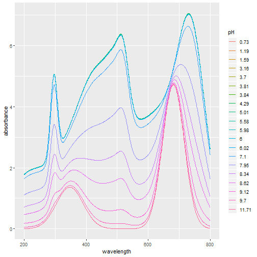

UV-Vis spectra synthesis - pitch presentation in R Presenter
========================================================
author: Nino Pozar 
date: 29 January 2019
autosize: true

Introduction
========================================================

This app is primarily intended for analytical chemist for for usage in chemical analysis.

The input of the app:
 - number of pKa values
 - set.seed value
 
The output of this analysis:
 - plot of UV-Vis spectra 
 - the table of it's pKa values. 
 
With given input, the app constructs a spectra for 20 randomly chosen pH values and creates UV-Vis spectra as sum of Gaussian functions for given number of pKa values. The pKa values are randomly given in the interval 0-14.

The app is available at.  http://ajanglezero.shinyapps.io/project_shiny_DDP

Needed packages and analysis code
========================================================

The needed packages for this app are:
 - dplyr
 - ggplot2
 - tidyr
 - knitr
 


Functions to create the analysis

Functions created for this app are too long and complicated to be shown in this short pick presentation. If interested, there is a supporting RMarkDown documentation to go along with the app also posted in this repo. More interested reader is suggested to read the documentation.


Example analysis for number of pKas=1 and set.seed=10
========================================================

Here we do the example analysis of the app, for number of pKas=1 and set.seed=10. First, 20 pH values are simulated from the uniform distribution in range 0-14. Secondly spectras are created for 1 pKa value randomly chosen from uniform distribution in range 0-14. And finally in the end spectra are plotted using ggplot and table of simulated pKa values is given. 


```r
i <- 1
sseed <- 10
set.seed(sseed)
pH <- runif(20,0,14)
x <- spectras(i, pH, pK=runif(i,0,14))
s <- as.data.frame(x$spectra)
names(s) <- 200:800
m <- ncol(s)
s <- s %>%
  gather(wavelength,absorbance) %>%
  mutate(pH=as.factor(rep(round(pH,2),601))) %>%
  mutate(wavelength=as.numeric(wavelength))
g <- ggplot(s, aes(x=wavelength, y=absorbance, group=pH, color=pH)) + geom_line()
f <- data.frame(pK=paste("pKa", 1:i, sep=""), value=round(x$pK,2))  
```

The result of the example analysis
========================================================



|      |pK   | value|
|:-----|:----|-----:|
|pKa_1 |pKa1 |  8.17|
